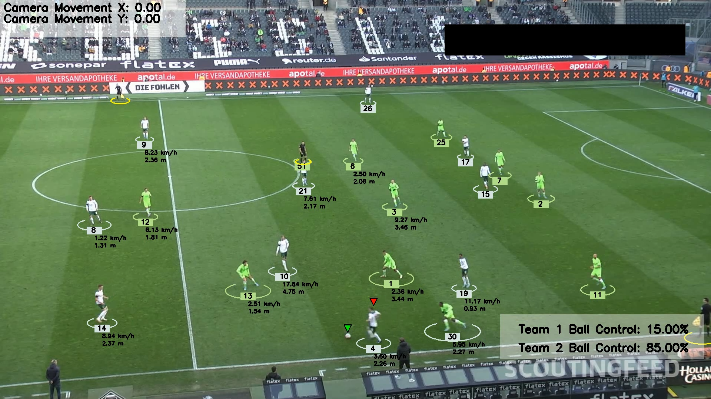

# AI/ML Football Analysis System

## Overview

This project is an advanced AI/ML-based football analysis system that leverages state-of-the-art object detection, tracking, and various computer vision techniques to provide comprehensive insights into football matches. The system is capable of tracking players, referees, and the ball, assigning players to teams, estimating camera movement, transforming perspective, and calculating player speeds and distances.

## Output Video

The output video can be found [here](output_videos/output_video.avi) or played [here](https://youtu.be/CIiiL-BNOI4) a screenshot can be viewed below:

## Project Structure

- `main.py`: Entry point of the application.
- `trackers/`: Contains the `Tracker` class for object detection and tracking.
- `team_assigner/`: Implements player team assignment using K-means clustering.
- `camera_movement_estimator/`: Estimates camera movement using optical flow.
- `perspective_transformer/`: Handles the transformation between pixel and real-world coordinates.
- `speed_and_distance_estimator/`: Calculates player speeds and distances.
- `utils/`: Helper functions and utilities.
- `models/`: Directory to store trained models.
- `input_videos/`: Place input videos here.
- `output_videos/`: Annotated output videos are saved here.

## Key Features

1. **Object Detection and Tracking**: Utilizes YOLOv8 for detecting players, referees, and the ball, with custom training to enhance performance.
2. **Player Team Assignment**: Uses K-means clustering on player jersey colors to group players into teams.
3. **Ball Interpolation**: Ensures continuous ball tracking even when occluded.
4. **Camera Movement Estimation**: Employs optical flow to account for camera movement in player tracking.
5. **Perspective Transformation**: Converts pixel-space measurements to real-world distances on the field.
6. **Speed and Distance Estimation**: Calculates each player's speed and total distance covered during the match.
7. **Team Ball Control**: Analyzes which team has possession of the ball (stretch goal).

## Machine Learning Methods

### 1. Object Detection and Classification (YOLO - You Only Look Once)

- **YOLOv8**: The latest version of YOLO from Ultralytics is used for real-time object detection. YOLO divides images into a grid and predicts bounding boxes and class probabilities for each grid cell, allowing it to detect players, referees, and the ball simultaneously.
- **Custom Training**: To improve accuracy for this specific use case, YOLOv8 was fine-tuned on a custom dataset of football scenes, enhancing its ability to distinguish between players, goalkeepers, referees, and the ball.

### 2. Object Tracking (ByteTrack)

- After detection, ByteTrack, a simple yet effective tracking algorithm, is employed. ByteTrack associates detections across frames by utilizing both high-confidence and low-confidence detections, which helps maintain player identities even during occlusions or missed detections.

### 3. Player Team Assignment (K-means Clustering)

- **Color-based Segmentation**: For each detected player, RGB values are extracted from the upper half of their bounding box, which typically contains the jersey.
- **K-means Clustering**: K-means (with K=2 for two teams) is applied to cluster players based on their jersey colors. This unsupervised learning technique partitions players into two groups by minimizing within-cluster distances.
- **Dynamic Team Color Assignment**: The centroid colors from K-means become the representative team colors, allowing for automatic adaptation to different matches without hard-coding team colors.

### 4. Camera Movement Estimation (Optical Flow)

- **Lucas-Kanade Optical Flow**: This differential method computes the motion between two image frames for a sparse feature set (corner points). By tracking these points, the overall camera movement is estimated.
- **Homography Transformation**: Using the movement of tracked points, a homography matrix is computed that describes the change in perspective between frames, which is crucial for accurate player positioning and speed calculations.

### 5. Ball Tracking and Interpolation

- **Kalman Filtering**: When the ball is occluded or not detected, a Kalman filter is used to predict its position based on previous observations. This recursive estimator minimizes the mean squared error, providing smooth ball trajectories.
- **Trajectory Fitting**: For longer occlusions, a parabolic curve is fitted to the ball's last known positions, mimicking the physical properties of ball movement.

### 6. Perspective Transformation

- **Four-Point Perspective Transform**: By mapping four points on the image to their corresponding real-world coordinates on a standard football pitch, a transformation matrix is computed using `cv2.getPerspectiveTransform()`.
- This allows for conversion of pixel distances in the image to actual meters on the field, accounting for the effects of perspective.

### 7. Speed and Distance Estimation

- **Euclidean Distance**: In the transformed space (real-world coordinates), the Euclidean distance between a player's positions in consecutive frames is calculated.
- **Sliding Window Averaging**: To smooth out noise in speed calculations, a sliding window approach is used, computing speed over a fixed number of frames rather than between consecutive frames.

### 8. Team Ball Control Analysis (Stretch Goal)

- **Proximity Analysis**: Ball possession is determined by analyzing which team's players are closest to the ball over a series of frames.
- **Direction of Movement**: The relative movement of the ball towards players of a particular team is also considered as an indicator of possession.

\

## Technologies Used

- YOLOv8 (Ultralytics)
- OpenCV (cv2)
- NumPy
- Roboflow (for dataset management)
- Kaggle (for GPU-accelerated training)

## Further Research and Development

1. **Player Action Recognition**: Implement models to recognize specific player actions like passes, shots, tackles.
2. **Tactical Analysis**: Analyze team formations, player heatmaps, and passing networks.
3. **Referee Decision Analysis**: Automate the review of key decisions like offsides and fouls.
4. **Integration with Wearable Data**: Combine video analysis with data from player wearables for enhanced insights.
5. **Real-time Processing**: Optimize the pipeline for live game analysis and feedback.
6. **Multi-camera Setup**: Extend the system to work with multiple camera angles for 3D positioning.
7. **Player Identification**: Implement face recognition or jersey number detection to identify individual players.
8. **Performance Prediction**: Use historical data and in-game stats to predict player or team performance.
9. **Injury Risk Assessment**: Analyze player movements and loads to flag potential injury risks.
10. **Fan Engagement Applications**: Develop interactive visualizations or AR/VR experiences based on the analyzed data.

## Datasets

- [Kaggle Dataset](https://www.kaggle.com/competitions/dfl-bundesliga-data-shootout/data?select=clips)
- [Roboflow Dataset](https://universe.roboflow.com/roboflow-jvuqo/football-players-detection-3zvbc/dataset/1)
